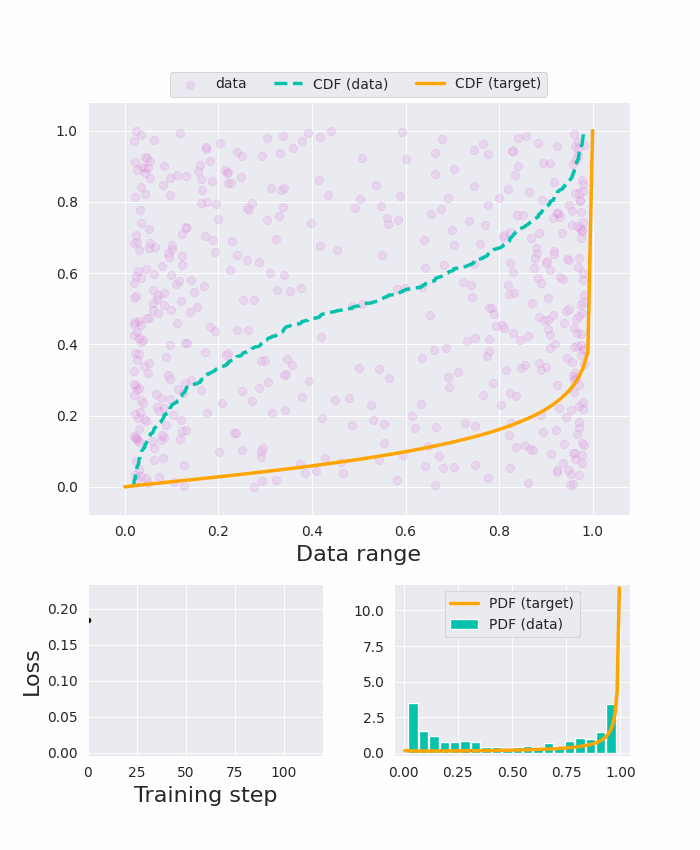

# Batch-Shaping Loss for Learning Conditional Channel Gated Networks

This repository contains an implementation of the **Batch-Shaping loss**, a distribution matching tool derived from the  Cramér–von Mises goodness of fit criterion. The Batch-Shaping loss was introduced in the paper [Batch-Shaping Loss for Learning Conditional-Channel Gated Networks, Bejnordi et al, ICLR 2020](https://arxiv.org/abs/1907.06627), and was later generalized to multi-dimensional inputs in [MSViT: Dynamic Mixed-Scale Tokenization for Vision Transformers, Havtorn et al, arXiv 2023](http://arxiv.org/abs/2307.02321).


## Getting Started
The code in this repository has been tested for Python 3.8.10. To get started, `git clone` this repository. `cd` to the cloned directory and create a virtual environment for the project: 

```bash
git clone https://github.com/qualcomm-ai-research/batchshaping
cd batchshaping
python3 -m venv env
source env/bin/activate
pip install -r requirements.txt
```

## Repository Structure
The repository is organized as follows

```tree
├── batchshaping    
│   ├── __init.py__
│   ├── batch_shaping_loss.py: Return the (generalized) batch shaping loss for a given input tensor
│   ├── cdf_beta.py: Differentiable CDF of the Beta distribution
│   ├── cdf_normal.py: Differentiable CDF of the Normal distribution
│   ├── cdf_relaxedbernoulli.py: Differentiable CDF of the Relaxed Bernoulli distribution
│   ├── utils.py: Minor utils functions
│   ├── viz_utils.py: Minor utils specific to the notebooks' animation visualizations
├── outputs
│   ├── *.gif : saved outputs of the notebook experiments
├── LICENSE
├── README.md
├── batch_shaping.ipynb: Notebook example for the Batch-Shaping (BaS) loss
├── generalized_batch_shaping.ipynb: Notebook example for the generalized Batch-Shaping (gBaS) loss
├── requirements.txt
```

## Running experiments
The repository includes two notebooks with further explanation and example usages of the Batch-Shaping loss:
  * [`batch_shaping.ipynb`](batch_shaping.ipynb) for examples of fitting continuous data to different prior distributions via their CDF
  * [`generalized_batch_shaping.ipynb`](generalized_batch_shaping.ipynb) for an example of fitting multiple sets of continuous data to different priors, where the latent prior parameters are learned by the model and controlled via a hyperprior distribution


### Example of the Batch-Shaping (BaS) loss 
The data points are trained to match a Beta(0.9, 0.1) prior using Batch-Shaping




### Illustration of the Generalized Batch-Shaping (gBaS) loss 
The multi-dimensional data points are trained to match multiple Relaxed Bernoulli priors (one independent prior per dimension) such that the means and temperatures are also learned by the model and controlled by a Beta(3, 7) hyperprior


## Citation
if you use the (generalized) Batch-Shaping loss in your research, please use the following citations
```
@inproceedings{Bejnordi2019BatchshapingFL,
  title={Batch-{S}haping for learning conditional channel gated networks},
  author={Babak Ehteshami Bejnordi and Tijmen Blankevoort and Max Welling},
  booktitle={ICLR},
  year={2020}
}

@inproceedings{havtorn2023msvit,
      title={MSViT: Dynamic Mixed-Scale Tokenization for Vision Transformers}, 
      author={Jakob Drachmann Havtorn and Amelie Royer and Tijmen Blankevoort and Babak Ehteshami Bejnordi},
      year={2023},
      booktitle={ICCV Workshop on New Ideas in Vision Transformers},
}
```
